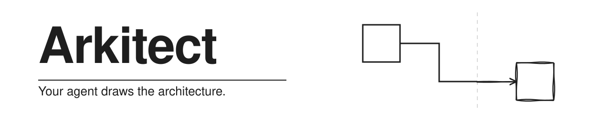

<div align="center">

<picture>
  <source media="(prefers-color-scheme: dark)" srcset="docs/brand/arkitect-banner-dark.svg">
  
</picture>

Editable **Draw.io** and **Excalidraw** diagrams, generated and edited by your
coding agent, on your machine.

[](https://www.npmjs.com/package/arkitect)
[](LICENSE)
[](package.json)
[](package.json)
[](docs/icons.md)

</div>

---

Arkitect turns a small JSON spec into a `.drawio` or `.excalidraw` source file:
real product icons embedded, every edge connected, laid out so nothing runs
through anything. You keep editing it in Draw.io or Excalidraw. The agent
writes the spec, builds, validates, renders the result and looks at it before
it reports.

<div align="center">


<sub>Built from a 48-node spec in one command, no hand-editing.</sub>

</div>

## Install

```bash
# Claude Code: the plugin, six skills, model-invoked
claude plugin marketplace add mouadja02/arkitect
claude plugin install arkitect@arkitect

# Any other agent, or the CLI alone
npm install -g arkitect
cd ~/my-project && arkitect install --all      # adapters for Codex, Cursor, Copilot, ...

# One command, nothing installed
npx arkitect excalidraw icon "postgres"
```

Then ask:

> Draw an architecture for an event-driven order system: a web app posts to an
> API gateway, orders land on a queue, a worker validates them and writes to
> Postgres, failures go to a dead-letter queue, and a nightly job reconciles
> against the warehouse. Save it to `docs/orders.excalidraw`.

Every route, and setup per agent: [docs/install.md](docs/install.md).

## What you get

- **Two engines, one workflow.** Draw.io for formal architecture a client or a
  review board will see; Excalidraw for sketches, system design and READMEs.
- **6,005 icons bundled.** 4,843 marks in 18 shared packs (AWS, Azure, Google
  Cloud, data platforms, databases, AI frameworks, streaming, observability,
  DevOps, security, SaaS, languages and more) plus 1,162 items
  across 36 Excalidraw libraries. Searched by product name, offline, and
  flagged when the match isn't clear enough to trust.
- **Honesty about what's missing.** A product nothing covers gets a
  placeholder, named in the report, never another product's mark. A real logo
  is fetched only when you ask.
- **Layout the builder works out.** Edges leave and enter from the right
  sides, route round what's in the way, and keep their labels clear; the
  routes survive dragging a node in Draw.io Desktop and in the Excalidraw app.
- **Checks in code, not in the prompt.** `validate` names every edge through
  an icon and every label over a border; the build report hands the agent the
  exact node to paste when a box should have been an icon or a boundary.
- **Your style.** The house style carries the evidence for each rule. Point
  the learning skill at your own diagrams and choose what to adopt.
- **Nothing is uploaded.** No telemetry, no hosted step, no dependencies.

## What it optimises for

Two constraints outrank every feature: **stay functional and lightweight** (no
dependencies, no services, no build step) and **work with whatever model is
driving**, so a small local model gets a good diagram and not only a frontier
one. Context is the scarce resource: each skill's reading budget is measured,
and layout, icon resolution and validation live in scripts, not prompts.
[`AGENTS.md`](AGENTS.md#what-arkitect-optimises-for--this-does-not-get-traded-away)
has the full statement.

## Which engine?

|  | **Draw.io** `.drawio` | **Excalidraw** `.excalidraw` |
|---|---|---|
| looks | crisp, formal, vendor icons | hand-drawn |
| for | a client, a review board, an RFC; AWS-heavy designs; several pages; as-is/to-be | system design, component and block diagrams, flows, README art |
| icons | 18 packs, 4,843 marks + built-in `mxgraph.aws4.*` + fetched logos | 1,162 native items across 36 libraries + 4,843 shared marks as embedded artwork |
| edit in | Draw.io Desktop or VS Code, never the hosted editor | the local container (`npm run excalidraw:up`) or excalidraw.com |

<div align="center">


<sub>The Draw.io starter template: every node kind, every connector kind, a generated legend.</sub>

</div>

## Agents

| agent | loads | install |
|---|---|---|
| **Claude Code** | plugin: 6 skills, 2 hooks | `claude plugin install arkitect@arkitect` |
| **Codex** | `AGENTS.md` + `.agents/skills/arkitect` (`$arkitect`) | `arkitect install codex` |
| **Cursor** | `.cursor/rules/arkitect.mdc` + `/diagram` | `arkitect install cursor cursor-command` |
| **OpenCode** | `AGENTS.md` + `.opencode/command/diagram.md` | `arkitect install opencode agents` |
| **GitHub Copilot** | `.github/copilot-instructions.md` | `arkitect install copilot` |
| **Antigravity**, **Pi** | `AGENTS.md` | `arkitect install antigravity` / `pi` |
| anything else | `AGENTS.md`, or paste it into the tool's rules | `arkitect install agents` |

| skill | runs |
|---|---|
| `arkitect-drawio`, `arkitect-excalidraw` | on their own, when a diagram is asked for |
| `learn-drawio-style`, `learn-excalidraw-style` | only when you type the command |
| `apply-drawio-style`, `apply-excalidraw-style` | only when you type the command |

## Documentation

| | |
|---|---|
| [install.md](docs/install.md) | every install route, npm and npx, setup per agent, update and removal |
| [getting-started.md](docs/getting-started.md) | your first diagram |
| [cli.md](docs/cli.md) | every command, the spec format, rendering |
| [icons.md](docs/icons.md) | what ships, how search decides, logos, libraries, placeholders |
| [apps.md](docs/apps.md) | the local Excalidraw container, Draw.io Desktop, the Draw.io MCP server |
| [style.md](docs/style.md) | the house style, and making it yours |
| [privacy.md](docs/privacy.md) | exactly what touches the network |
| [testing.md](docs/testing.md) | the offline suite, the redaction check, the evals |
| [maintenance.md](docs/maintenance.md) | the contract for changing this repository, releases |
| [audit-prompt.md](docs/audit-prompt.md) | the prompt that finds the next round of work |
| [status.md](docs/status.md) | where the project stands |

What changed in each release: [CHANGELOG.md](CHANGELOG.md).

## Privacy

Your diagrams never leave the machine. Two things reach the network, both
public and free of anything about your architecture: a product logo you asked
for by URL, and the public Excalidraw library catalogue. The Draw.io MCP tools
that open the hosted editor are off-limits for your content, and the style
record holds structural statistics only, which a test checks on every run.
[docs/privacy.md](docs/privacy.md).

## Contributing

Issues and pull requests are welcome: patterns, icon coverage, another agent
adapter, a bug in a generator. Start with [CONTRIBUTING.md](CONTRIBUTING.md);
the suite is `node tests/run-tests.mjs`, offline, in about 20 seconds.

## Credits and license

Arkitect draws with other people's work: the AWS, Azure and Google Cloud icon
sets, Simple Icons, devicon, Lucide and Octicons, and 36 Excalidraw libraries
from the public catalogue, each credited in
[ATTRIBUTION.md](skills/arkitect-excalidraw/assets/libraries/bundled/ATTRIBUTION.md)
and the [pack attribution](skills/arkitect-drawio/assets/libraries/ATTRIBUTION.md).

[MIT](LICENSE) for the code, docs and generators. Bundled icon sets remain
under their own terms; see [NOTICE](NOTICE).
