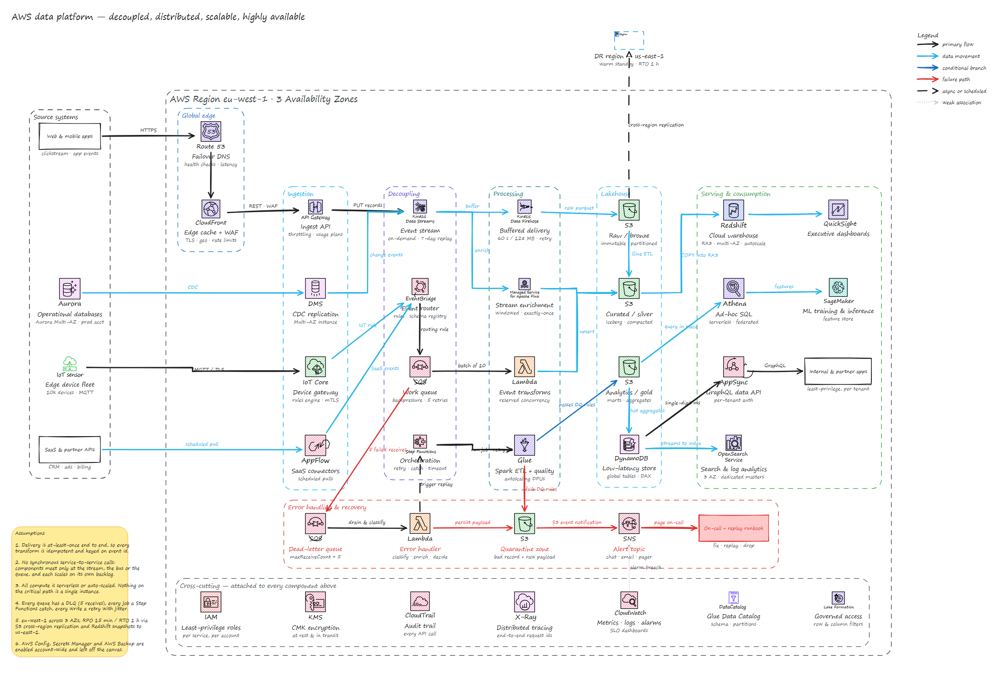
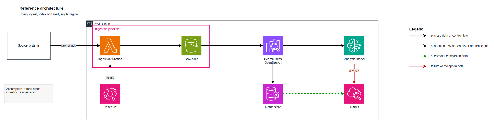

<div align="center">

# Arkitect

**Your agent draws the architecture.**

Editable **Draw.io** and **Excalidraw** diagrams — cloud architectures, system designs,
data pipelines, agentic systems, network views and flow diagrams — generated and edited
by your coding agent, entirely on your machine.

[](LICENSE)
[](package.json)
[](package.json)
[](docs/icons.md)

</div>

---

Most agents answer "draw me an architecture" with a Mermaid block or a picture. Neither
survives contact with reality: you cannot nudge a box, recolour a boundary, or hand it to
a colleague who needs to change one arrow.

Arkitect produces **the source file** — `.drawio` XML or `.excalidraw` JSON — with real
product icons embedded, a consistent style applied, every edge connected, and a render the
agent actually looked at before saying it was done.

<div align="center">



<sub>Generated from a 48-node spec, one command, no hand-editing.</sub>

</div>

## What you get

- **Two engines, one contract.** Draw.io when it has to look formal; Excalidraw when it
  should look thought-through rather than filed. Same workflow, same spec idea, same
  honesty rules.
- **6,005 icons bundled.** 4,843 marks in 18 shared packs — AWS, Azure, Google Cloud,
  data platforms, databases, AI frameworks, ML, streaming, observability, DevOps,
  security, GitHub, SaaS, languages, file types, and agent concepts — plus 1,162 items
  across 36 Excalidraw libraries. All searchable by product name, ranked so a curated
  pack beats a catch-all, and flagged when the match is not clear enough to trust.
  No download, works offline. Excalidraw uses the [shared packs](docs/shared-icons.md)
  as embedded original artwork when its native libraries have no confident match.
- **Real logos for everything else.** Point it at a product's asset and it fetches,
  transparency-checks and embeds it — or traces an SVG into native Excalidraw geometry so
  the mark takes the hand-drawn stroke and stays editable.
- **An honest placeholder** when nothing matches: a dotted slot with a `?`, named in the
  build report. Never one product's mark standing in for another.
- **A style with receipts.** Every rule in the style guide carries the evidence count
  behind it, and the ones that are just sensible defaults say so. Point the learning skill
  at your own diagrams and it becomes *your* style, merged rather than overwritten.
- **Nothing is uploaded.** Ever. Your architecture stays on your disk.
- **Zero dependencies.** Node 20+, that is the whole install.

## Quick start

<details open>
<summary><b>Claude Code</b> — as a plugin</summary>

```bash
claude plugin marketplace add mouadja02/arkitect
claude plugin install arkitect@arkitect
```

or clone it into your skills directory, which is the same thing without the marketplace:

```bash
git clone https://github.com/mouadja02/arkitect.git ~/.claude/skills/arkitect
```

Then just ask — the skills are model-invoked, there is no command to remember.

</details>

<details>
<summary><b>Codex · Cursor · OpenCode · Copilot · Antigravity · Pi</b> — as a toolkit</summary>

```bash
git clone https://github.com/mouadja02/arkitect.git ~/arkitect
cd ~/my-project
node ~/arkitect/bin/arkitect.mjs install --all      # writes the adapter your agent reads
```

That drops `AGENTS.md`, `.cursor/rules/`, `.github/copilot-instructions.md` and
`.opencode/command/` into *your* project, each pointing at the Arkitect install. Pick one
instead of `--all` if you only use one tool. Details: **[docs/agents.md](docs/agents.md)**.

</details>

<details>
<summary><b>No agent at all</b> — as a CLI</summary>

```bash
node bin/arkitect.mjs                             # every command, one screen
node bin/arkitect.mjs doctor                      # what is installed, what is optional
node bin/arkitect.mjs excalidraw icon "postgres"
node bin/arkitect.mjs excalidraw build my-spec.json --out docs/arch.excalidraw
```

</details>

Then ask for a diagram in plain language:

> Draw an architecture for an event-driven order system: a web app posts to an API
> gateway, orders land on a queue, a worker validates them and writes to Postgres,
> failures go to a dead-letter queue, and a nightly job reconciles against the warehouse.
> Save it to `docs/orders.excalidraw`.

## Which engine?

|  | **Draw.io** `.drawio` | **Excalidraw** `.excalidraw` |
|---|---|---|
| looks like | crisp, formal, vendor icons | hand-drawn, sketchy |
| reach for it when | a client, a review board or an RFC will see it; the design is AWS-heavy; you need multiple pages or an as-is/to-be comparison | it is system design, a component or block diagram, a flow, or art for a README |
| icons | 18 packs, 4,843 marks + built-in `mxgraph.aws4.*` + fetched product logos | 1,162 native items across 36 libraries + 4,843 shared marks embedded as original artwork |
| edit it in | Draw.io Desktop, the VS Code extension, app.diagrams.net | the Excalidraw container this repo ships, or excalidraw.com |
| local viewer | Draw.io Desktop (optional) | `docker compose up -d` (optional) |

<div align="center">



<sub>The Draw.io starter template — every node kind, every connector kind, a generated legend.</sub>

</div>

## Agent compatibility

Arkitect is a plugin for Claude Code and a plain toolkit for everything else. Nothing about
it is model-specific: the engines are Node scripts, and the agent layer is a contract file
in whatever format your tool reads.

| agent | how it loads | command |
|---|---|---|
| **Claude Code** | plugin — 4 skills, model-invoked | `claude plugin install arkitect@arkitect` |
| **Codex** | `AGENTS.md` (+ `~/.codex/prompts/` for `/diagram`) | `arkitect install codex` |
| **Cursor** | `.cursor/rules/arkitect.mdc` + `/diagram` command | `arkitect install cursor cursor-command` |
| **OpenCode** | `AGENTS.md` + `.opencode/command/diagram.md` | `arkitect install opencode agents` |
| **GitHub Copilot** | `.github/copilot-instructions.md` | `arkitect install copilot` |
| **Antigravity** | `AGENTS.md` | `arkitect install antigravity` |
| **Pi** | `AGENTS.md` | `arkitect install pi` |
| **anything else** | `AGENTS.md`, or paste it into the tool's rules panel | `arkitect install agents` |

Full setup per tool, including the MCP server and what to do when a tool reads none of
these: **[docs/agents.md](docs/agents.md)**.

## The local apps

Both are **optional** — generation, validation and preview work without either.

```bash
# Excalidraw, the real app, no backend, nothing uploaded
docker compose -f docker/docker-compose.yml up -d          # http://localhost:3000

# Draw.io editing over MCP (list pages, read a page, write a page, search shapes)
claude mcp add --scope user drawio -- npx --yes --ignore-scripts @drawio/mcp
```

→ **[docs/excalidraw-docker.md](docs/excalidraw-docker.md)** ·
**[docs/drawio-mcp.md](docs/drawio-mcp.md)**

## Documentation

| | |
|---|---|
| [docs/install.md](docs/install.md) | requirements, every install route, update and removal |
| [docs/agents.md](docs/agents.md) | Claude Code, Codex, Cursor, OpenCode, Copilot, Antigravity, Pi — setup per tool |
| [docs/getting-started.md](docs/getting-started.md) | your first diagram, in either engine |
| [docs/cli.md](docs/cli.md) | every command, both engines, and the spec format |
| [docs/drawio-mcp.md](docs/drawio-mcp.md) | the Draw.io MCP server: what it is for and which tools are safe |
| [docs/excalidraw-docker.md](docs/excalidraw-docker.md) | the local Excalidraw container, and what it can and cannot do |
| [docs/icons.md](docs/icons.md) | the bundled icon sets, placeholders, logos, tracing |
| [docs/style.md](docs/style.md) | the house style, and how to replace it with your own |
| [docs/testing.md](docs/testing.md) | the offline suite, the redaction check, the evals |
| [docs/maintenance.md](docs/maintenance.md) | the contract for changing this repo — invariants, and what is never automated |
| [docs/privacy.md](docs/privacy.md) | exactly what touches the network, and what never does |

## The skills

| skill | invocation | what it does |
|---|---|---|
| `arkitect-drawio` | automatic | create or edit `.drawio` architecture diagrams |
| `arkitect-excalidraw` | automatic | create or edit `.excalidraw` diagrams and scenes |
| `learn-drawio-style` | `/learn-drawio-style` only | fold your own `.drawio` files into the style record |
| `learn-excalidraw-style` | `/learn-excalidraw-style` only | fold your own scenes into the style record |

The learning skills carry `disable-model-invocation: true`. They rewrite the style
knowledge, so they never fire on their own — reading or discussing a diagram never
triggers one.

## Privacy

Your diagrams never leave the machine. There is no telemetry, no upload, no hosted step.

Exactly two things reach the network, both public and both free of anything about your
architecture: **a product logo you asked for by URL**, and **the public Excalidraw library
catalogue**. Agents are instructed never to put a customer name, codename or hostname into
a search query. The Excalidraw container is the static app with no backend; the Draw.io MCP
tools that open the *hosted* editor are explicitly off-limits for your content.

The derived style record is structural statistics and digests only — no labels, page
names, file names, paths or image payloads. A test enforces that on every run.

→ **[docs/privacy.md](docs/privacy.md)**

## Contributing

Issues and pull requests are welcome — new patterns, new icon coverage, another agent
adapter, a bug in the generators. Start with **[CONTRIBUTING.md](CONTRIBUTING.md)**; the
suite is `node tests/run-tests.mjs` and it runs offline in about 20 seconds.

## Credits

Arkitect stands on other people's work: the **AWS Architecture Icons** published by Amazon
Web Services, and **36 Excalidraw libraries** contributed to the public catalogue by their
authors, each credited in
[ATTRIBUTION.md](skills/arkitect-excalidraw/assets/libraries/bundled/ATTRIBUTION.md).
Draw.io, diagrams.net and Excalidraw are the tools that make any of this worth doing.

See [NOTICE](NOTICE) for the full attribution and trademark statement.

## License

[MIT](LICENSE) — the Arkitect code, docs and generators. Bundled third-party icon sets
remain under their own terms; see [NOTICE](NOTICE).
